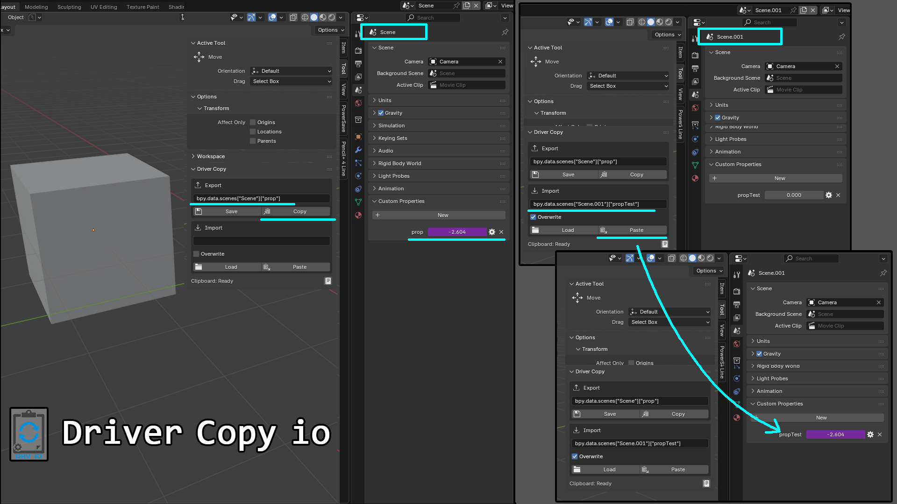
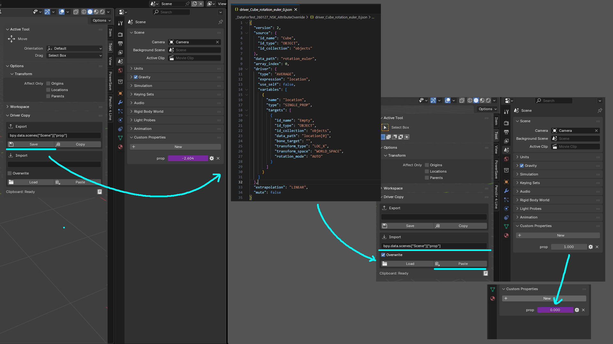

# driver_copy_io
Blender用のアドオンです。

オブジェクト間でドライバーをJSON形式でコピー＆ペーストできます。
- クリップボード経由でドライバーを複製
- JSONファイルに保存/読込してバックアップや共有が可能
- `bpy.data.objects["Name"].property` 形式のフルパスで正確に指定



## 【導入方法】
[プリファレンス > アドオン > インストール] から `driver_copy_addon.py` を選択して下さい。  
3Dビューのサイドパネル（Nキー）のツールに「Driver Copy」パネルが追加されます。

## 【使用方法】
1. 「Export」にコピー元のパスを入力（例: `bpy.data.objects["Cube"].location[0]`）
2. 「Copy」ボタンを押す
3. 「Import」にコピー先のパスを入力
4. 「Paste」ボタンを押す



### パス形式の例
```
bpy.data.objects["オブジェクト名"].location[0]
bpy.data.scenes["シーン名"]["カスタムプロパティ名"]
bpy.data.materials["マテリアル名"].node_tree.nodes["ノード名"].inputs[0].default_value
```

## 【動作環境】
Blender 4.2.0 以降で動作確認しています。

## 【更新履歴】
#### [2025-02-09 v2.1.1]
- パッケージから不要ファイルを除外

#### [2025-01-29 v2.1.0]
- GitHub公開
- README追加

## 【ライセンス】
GPL-3.0-or-later
